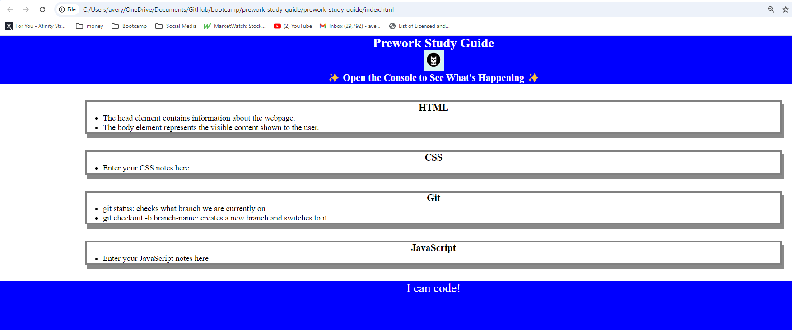
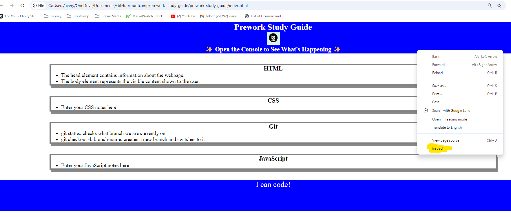
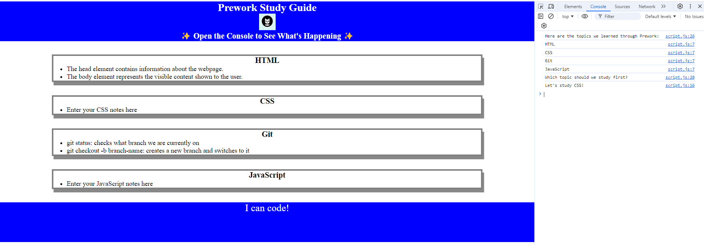

# <Avery's Prework Study Guide>

## Description

Provide a short description explaining the what, why, and how of your project. Use the following questions as a guide:

- What was your motivation?

I want to improve my skills as a programmer so that I can expand my job skills. 

- Why did you build this project? (Note: the answer is not "Because it was a homework assignment.")

I want to understand html, css, javascript and github

- What problem does it solve?

Creates a webpage for notes and allows the public to see those notes

- What did you learn?

How to think like a developer and cultivate the effective develloper habits. 
How to set up a web development project. 
how to create issues
html
-HTML Structure, tags, linkings css and javascript files, child elements
css
-creating file, linking, adding style

javascript
-how to add a javascript file. Adding a variable, conditional logic, arrays, loops, functions, function calls, 
git 
-how to create repositories 
- how to create branches
- how to save changes
- how to merge 

how to create a professional readme 

Deployment and made app live on the internet 

## Table of Contents 

- [Installation](#installation)

    git
    gitbash
    visual studio code

- [Usage](#usage)

    Landing page screenshot 
    Developer tools screenshot
    Console sceenshot 

- [Credits](#credits)

    University of Minnesota 

- [License](#license)
    
    MIT License

- [features](#features)

    html
    CSS
    JavaScript
    developer tools

- [howToContribute](#howToContribute)

    Standard

- [tests](#tests)

    Regression tests

## Installation

If you don't have already go to the git website and install git. Durring the instalation install the gitbash terminal. If you don't have already install visual studio code. Create or sign into your github account. Using the github url go to the repo and clone the repo by copying the HTTPS url or if you have a SSH key set up you can copy the ssh url. Open the gitbash terminal and navigate to the directory where you want to put the repo. In the git bash terminal type: git clone "[<repo Url>](https://github.com/TheReal4m4d3u5/prework-study-guide.git)". In VS code go to the folder where you cloned the repo to and open the repo's folder. Right click the index.html file and click "Open in default browser" to open the webpage. Right click the webpage and click inspect. Click on the console tab. 

## Usage

Open URL for the website

Right click on the website and click inspect

Click on the console tab

## Credits

University of Minnesota

https://bootcampspot.instructure.com/courses/6336/modules

## License

MIT License

Copyright (c) [2024] [Avery Jacobson]

Permission is hereby granted, free of charge, to any person obtaining a copy
of this software and associated documentation files (the "Software"), to deal
in the Software without restriction, including without limitation the rights
to use, copy, modify, merge, publish, distribute, sublicense, and/or sell
copies of the Software, and to permit persons to whom the Software is
furnished to do so, subject to the following conditions:

The above copyright notice and this permission notice shall be included in all
copies or substantial portions of the Software.

THE SOFTWARE IS PROVIDED "AS IS", WITHOUT WARRANTY OF ANY KIND, EXPRESS OR
IMPLIED, INCLUDING BUT NOT LIMITED TO THE WARRANTIES OF MERCHANTABILITY,
FITNESS FOR A PARTICULAR PURPOSE AND NONINFRINGEMENT. IN NO EVENT SHALL THE
AUTHORS OR COPYRIGHT HOLDERS BE LIABLE FOR ANY CLAIM, DAMAGES OR OTHER
LIABILITY, WHETHER IN AN ACTION OF CONTRACT, TORT OR OTHERWISE, ARISING FROM,
OUT OF OR IN CONNECTION WITH THE SOFTWARE OR THE USE OR OTHER DEALINGS IN THE
SOFTWARE.

## Features

html
CSS
JavaScript
developer tools

## How to Contribute

The [Contributor Covenant](https://www.contributor-covenant.org/)

## Tests

Given person access url 
And opens then website
When the website opens
Then person should see A blue banner for a header
And A blue banner for the footer section

Given person access url 
And opens then website
When the website opens
Then user should see Prework Study Guide for a header 
And underneath should be a cat photo 
And underneath should be text "Open the Console to See What's Happening with stars on each end"

Given person access url 
And opens then website
When the website opens
Then there should four cards displayed in the body  
And each block should have a grey boarder
And seach block should have a grey shadow boarder

Given person access url 
And opens then website
When the website opens
Then person should four cards with paragraphs One for HTML, CSS, Git and JavaScript
And appropraite notes should be in the body for each of the four headers

Given person access url 
And opens then website
When the website opens
Then there should be text "I can code" in the blue banner for the footer secion 

Given person access url 
And opens then website
When the website opens
And person right clicks the website
And clicks on the Console tab
Then the lines should be printed, the last printed line will be randomly choosen from the list:
Here are the topics we learned through Prework: 
HTML
CSS
Git
JavaScript
Which topic should we study first?
Let's study JavaScript!

